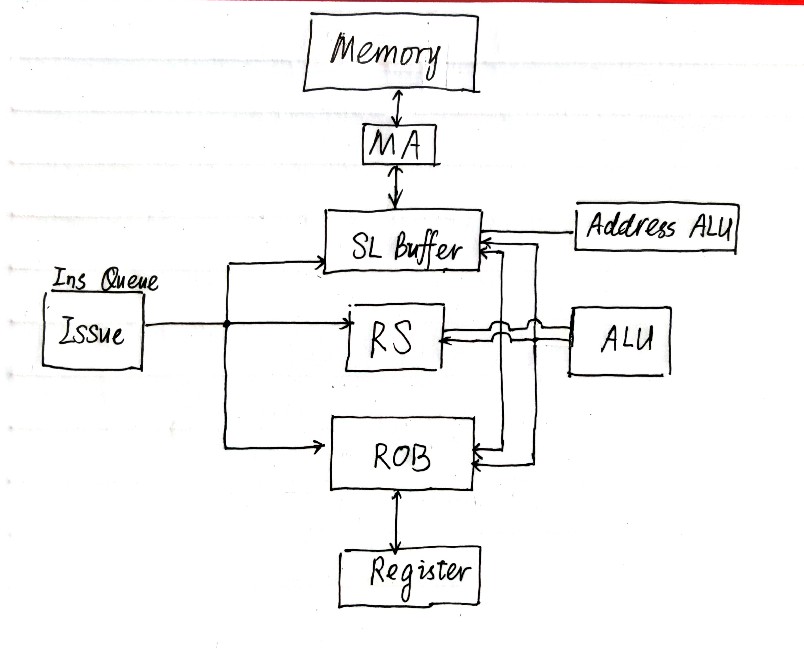

# RISC-V Simulator 2022

PPCA（CS1952）的第一个大作业。

## 实现方式

使用 Tomasulo 算法模拟 CPU 执行指令。设计的电路图如下：

## 关于分支预测

使用 2333 个二位饱和计数器，期望每个指令用一个计数器。预测的准确率如下表：

| 测试点         | 分支总数 | 成功预测数 | 预测成功率 |
| -------------- | :------: | :--------: | :--------: |
| array_test1    |    22    |     14     |   63.64%   |
| array_test2    |    26    |     16     |   61.54%   |
| basicopt1      |  155139  |   113495   |   73.16%   |
| bulgarian      |  71439   |   65400    |   91.55%   |
| expr           |   111    |     93     |   83.78%   |
| gcd            |   120    |     83     |   69.17%   |
| hanoi          |  17457   |   10793    |   61.83%   |
| lvalue2        |    6     |     5      |   83.33%   |
| magic          |  67869   |   52104    |   76.77%   |
| manyarguments  |    10    |     7      |   70.00%   |
| multiarray     |   162    |    130     |   80.25%   |
| naive          |    0     |     0      |     /      |
| pi             | 39956380 |  30703813  |   76.84%   |
| qsort          |  200045  |   168531   |   84.25%   |
| queens         |  77116   |   55882    |   72.46%   |
| statement_test |   202    |    119     |   58.91%   |
| superloop      |  435027  |   411593   |   94.61%   |
| tak            |  60639   |   44414    |   73.24%   |